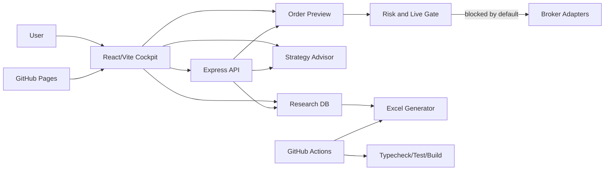

# Architecture

## 構成

- `src/shared/research.ts`: API、ブローカー、戦略DB
- `src/shared/strategyAdvisor.ts`: 推奨ロジック
- `src/shared/execution.ts`: 発注Intent検証とpayload生成
- `src/server/index.ts`: Express API
- `src/client/App.tsx`: Web UI
- `scripts/generate-research-workbook.ts`: Excel/CSV生成

## 安全設計

- Paper tradingが既定
- Live endpointは `LIVE_TRADING_ENABLED=true` なしで403
- トレーリング未対応ブローカーはemulatedとして明示
- 最大発注額、ポジション比率、日次損失、kill switchを本番前に設定
