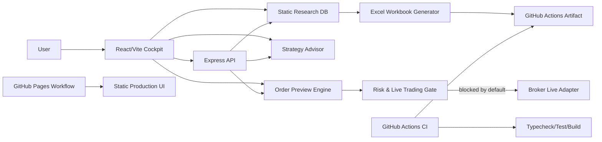

# Architecture

## 全体像

## フロントエンド

- `src/client/App.tsx`
- React + Vite + TypeScript
- タブ構成:
  - 全体像
  - API調査DB
  - 証券会社/取引所
  - 戦略ビルダー
  - 発注プレビュー

## 共有ロジック

- `src/shared/research.ts`
  - データプロバイダー、ブローカー、戦略テンプレートをAI可読なTypeScript配列で保持
- `src/shared/strategyAdvisor.ts`
  - ユーザー条件から戦略/API/ブローカー/リスク初期値を推奨
- `src/shared/execution.ts`
  - 正規化注文Intentをブローカー別payloadへ変換
  - トレーリングストップ対応差をwarningとして返す
  - Live発注は既定でblocked

## バックエンド

- `src/server/index.ts`
- Express API
- 主要エンドポイント:
  - `GET /api/health`
  - `GET /api/research`
  - `POST /api/strategy/recommend`
  - `POST /api/trading/order-preview`
  - `POST /api/trading/live-order`

## Excel生成

- `scripts/generate-research-workbook.ts`
- `xlsx` パッケージで以下のシートを生成:
  - Summary
  - API Providers
  - Broker APIs
  - Strategies
  - Secrets

CIで `dist/research/investing_api_research.xlsx` とCSVをartifact化します。

## CI/CD

- `.github/workflows/ci.yml`
  - checkout
  - setup-node
  - npm install
  - type check
  - test
  - build
  - Excel artifact upload
- `.github/workflows/deploy-pages.yml`
  - GitHub Pages用の静的UIをdeploy

## 本番運用に必要なもの

GitHub Pagesは静的UIのみです。実運用で自動売買APIを動かすには、以下が必要です。

1. 常駐できるAPIホスティング
   - Render / Fly.io / Railway / AWS ECS / VPS など
2. Secrets
   - `LIVE_TRADING_ENABLED=true`
   - ブローカーAPIキー
   - データAPIキー
3. 監視
   - 死活監視
   - 注文失敗アラート
   - 日次損失停止
   - 証拠金/余力チェック
4. ログ
   - 注文Intent
   - ブローカーpayload
   - 発注結果
   - 約定結果
   - エラーとリトライ
5. 実ブローカー別adapter
   - Alpaca REST
   - IBKR Gateway/TWS
   - Binance signed REST
   - Bybit/OKX/Kraken signed REST
   - kabuステーション localhost REST
   - 立花証券e支店 REST

## 安全設計

- Paper tradingが既定
- Live endpointは環境変数がなければ403
- トレーリングストップ未対応ブローカーはエミュレーションとして明示
- 最大発注金額・最大ポジション・最大日次損失をstrategy profileから初期化
- SecretsはREADMEやコードに書かず環境変数だけで管理
