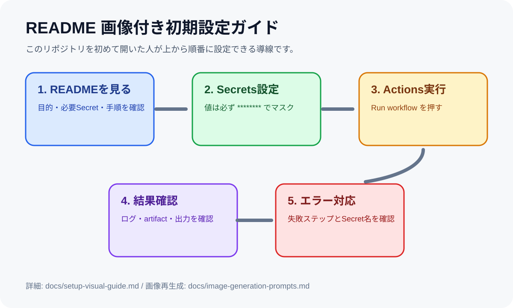

# 画像付き初期設定ガイド

## 1. 最初に見る場所

README冒頭の「画像付き初期設定ガイド」から、必要な設定と実行手順を確認します。

## 2. Secretsの扱い

実際の値はREADME、Issue、ログ、画像に貼りません。例は `********`、`YOUR_SECRET_HERE`、`your-folder-id` のようにマスクします。

## 3. 基本手順

1. README冒頭で必要なSecretと外部サービス設定を確認します。
2. GitHub Secrets または Cloudflare Secrets に値を登録します。
3. GitHub Actions の `Run workflow` を実行します。
4. Actionsログで成功・失敗を確認します。
5. Artifact、レポート、CSV、Excel、TXTなどの成果物を確認します。

## 4. エラー時の見る順番

1. Actions の赤い失敗ステップ
2. Secret名のスペル
3. 権限不足、API制限、対象フォルダIDやURL
4. READMEのトラブルシューティング

## 5. 対象repo

`stock-investment-simulator`
